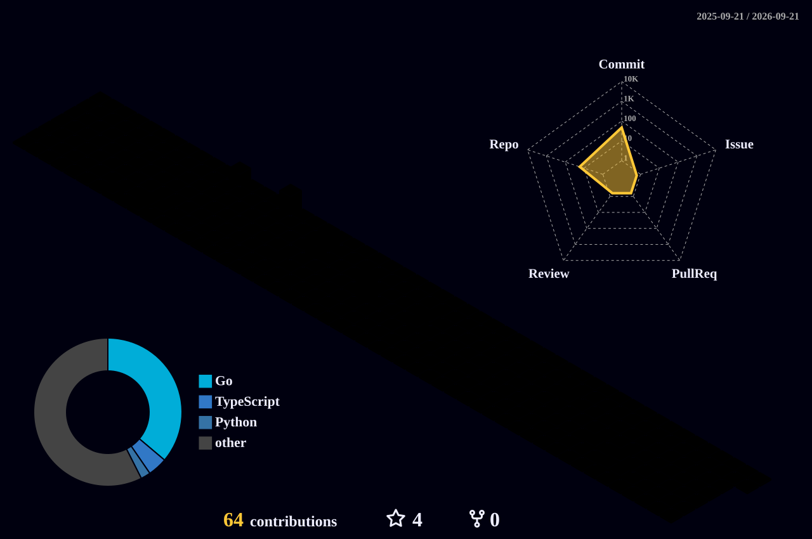

<!-- 
  ✨ COOL EFFECT LAYER ✨ 
  This style block creates a matrix-like grid background when viewed in a Markdown editor that supports HTML styles (like Typora or VS Code).
  It adds a subtle cyberpunk ambiance to the whole page.
-->

  

[![][social-xiaohongshu-shield]][social-xiaohongshu-link]
[![][social-email-shield]][social-email-link]

![][split]

<!--
### 🏆 Achievement Collection

  

### 📊 GitHub Analytics

  
  

  

-->

### 🧊 3D Contributions

  

### 💫 Tech Stack & Tools

<table width="100%">
  <tr>
    <td align="center"><b>Category</b></td>
    <td align="center"><b>Technologies</b></td>
  </tr>
  <tr>
    <td align="center"><b>Design</b></td>
    <td align="center">
      
      
      
    </td>
  </tr>
  <tr>
    <td align="center"><b>Frontend</b></td>
    <td align="center">
      
      
      
      
      
    </td>
  </tr>
  <tr>
    <td align="center"><b>Backend</b></td>
    <td align="center">
      
      
      
      
      
    </td>
  </tr>
  <tr>
    <td align="center"><b>AI / ML</b></td>
    <td align="center">
      
      
    </td>
  </tr>
  <tr>
    <td align="center"><b>DevOps</b></td>
    <td align="center">
      
      
      
      
    </td>
  </tr>
  <tr>
    <td align="center"><b>IDE</b></td>
    <td align="center">
      
      
      
    </td>
  </tr>
  <tr>
    <td align="center"><b>OS</b></td>
    <td align="center">
      
      
    </td>
  </tr>
</table>

 

### 🐍 Contribution Graph

<picture>
  <source media="(prefers-color-scheme: dark)" srcset="https://raw.githubusercontent.com/LDZ6/LDZ6/output/github-contribution-grid-snake-dark.svg">
  <source media="(prefers-color-scheme: light)" srcset="https://raw.githubusercontent.com/LDZ6/LDZ6/output/github-contribution-grid-snake.svg">
  
</picture>

 

### 📚 Recent Projects

<!-- RECENT_REPOS_START -->

<table width="100%">
<thead>
<tr>
<th>Project</th>
<th align="center">Language</th>
<th>Description</th>
</tr>
</thead>
<tbody>
<tr>
<td><a href="https://github.com/LDZ6/javanote"><b>javanote</b></a></td>
<td align="center">—</td>
<td>myJavaNote</td>
</tr>
<tr>
<td><a href="https://github.com/LDZ6/GOTCC"><b>GOTCC</b></a></td>
<td align="center">`Go`</td>
<td>Pure Go implementation of the Try-Confirm-Cancel pattern for distributed transaction coordination</td>
</tr>
<tr>
<td><a href="https://github.com/LDZ6/IAM"><b>IAM</b></a></td>
<td align="center">`Go`</td>
<td>A production-ready, enterprise-grade Identity and Access Management system built with Go, featuring comprehensive authentication, authorization, and policy management capabilities.</td>
</tr>
<tr>
<td><a href="https://github.com/LDZ6/gopractice_demo"><b>gopractice_demo</b></a></td>
<td align="center">`Go`</td>
<td>A comprehensive Go language practice repository featuring examples and best practices for popular frameworks, tools, and design patterns including Gin, gRPC, Cobra, GORM, various logging libraries, testing frameworks, and distributed systems components.</td>
</tr>
<tr>
<td><a href="https://github.com/LDZ6/ACM_ICPC_preparation"><b>ACM_ICPC_preparation</b></a></td>
<td align="center">—</td>
<td>ACM Competition Preparation Notes</td>
</tr>
<tr>
<td><a href="https://github.com/LDZ6/deepLearning"><b>deepLearning</b></a></td>
<td align="center">`Python`</td>
<td>My Deep Learning Notes</td>
</tr>
<tr>
<td><a href="https://github.com/LDZ6/SendsPlatfrom"><b>SendsPlatfrom</b></a></td>
<td align="center">`Go`</td>
<td>A modular microservices-based backend system for a WeChat campus assistant, enabling academic queries, festive games, financial reports, and user authentication with high concurrency and secure data handling.</td>
</tr>
<tr>
<td><a href="https://github.com/LDZ6/MIT-6.824"><b>MIT-6.824</b></a></td>
<td align="center">`Go`</td>
<td>麻省理工研究生课程项目：基于提供的Go语言代码框架，复刻论文细节，实现完整、容错、 分片的分布式存储系统，并通过含不可靠网络、服务器崩溃、客户端重启及RPC次数限制的全部测试样例</td>
</tr>
<tr>
<td><a href="https://github.com/LDZ6/go-dev-notes"><b>go-dev-notes</b></a></td>
<td align="center">`HTML`</td>
<td>Personal Go development notes and code snippets. Covers core syntax, standard libraries, best practices, and real-world examples.</td>
</tr>
</tbody>
</table>

<!-- RECENT_REPOS_END -->

### ⭐️ Blogs & Connections

You can checkout my blog [**here**](https://Lazard.ink).

> [!TIP]
> Feel free to explore my articles and projects, and connect with me on GitHub!
> Hit me up anytime and let's explore new ideas together! 😺✨

<!-- SHIELD GROUP -->
[banner]: ./README.assets/banner.webp
[signature]: ./README.assets/signature.svg
[backend-c]: https://img.shields.io/badge/-C-333333?style=flat-square&logo=c&logoColor=A8B9CC
[backend-cpp]: https://img.shields.io/badge/-C%2B%2B-00599C?style=flat-square&logo=c%2B%2B&logoColor=white
[backend-mysql]: https://img.shields.io/badge/-MySQL-4479A1?style=flat-square&logo=mysql&logoColor=white
[backend-go]: https://img.shields.io/badge/-Go-00ADD8?style=flat-square&logo=go&logoColor=white
[backend-python]: https://img.shields.io/badge/-Python-3776AB?style=flat-square&logo=python&logoColor=white
[design-ai]: https://img.shields.io/badge/-Illustrator-FF9A00?style=flat-square&logo=adobe%20illustrator&logoColor=white
[design-figma]: https://img.shields.io/badge/-Figma-F24E1E?style=flat-square&logo=figma&logoColor=white
[design-ps]: https://img.shields.io/badge/-Photoshop-31A8FF?style=flat-square&logo=adobe%20photoshop&logoColor=white
[frontend-css]: https://img.shields.io/badge/-CSS3-1572B6?style=flat-square&logo=css3&logoColor=white
[frontend-js]: https://img.shields.io/badge/-JavaScript-F7DF1E?style=flat-square&logo=javascript&logoColor=black
[frontend-react]: https://img.shields.io/badge/-React-61DAFB?style=flat-square&logo=react&logoColor=black
[frontend-ts]: https://img.shields.io/badge/-TypeScript-3178C6?style=flat-square&logo=typescript&logoColor=white
[frontend-vue]: https://img.shields.io/badge/-Vue.js-4FC08D?style=flat-square&logo=vue.js&logoColor=white
[ide-cursor]: https://img.shields.io/badge/-Cursor-000000?style=flat-square&logo=cursor&logoColor=white
[ide-vim]: https://img.shields.io/badge/-Vim-019733?style=flat-square&logo=vim&logoColor=white
[ide-vscode]: https://img.shields.io/badge/-VS_Code-007ACC?style=flat-square&logo=visual%20studio%20code&logoColor=white
[ml-pytorch]: https://img.shields.io/badge/-PyTorch-EE4C2C?style=flat-square&logo=pytorch&logoColor=white
[ml-r]: https://img.shields.io/badge/-R-276DC3?style=flat-square&logo=r&logoColor=white
[ops-docker]: https://img.shields.io/badge/-Docker-2496ED?style=flat-square&logo=docker&logoColor=white
[ops-nginx]: https://img.shields.io/badge/-Nginx-009639?style=flat-square&logo=nginx&logoColor=white
[ops-vercel]: https://img.shields.io/badge/-Vercel-000000?style=flat-square&logo=vercel&logoColor=white
[ops-github-action]: https://img.shields.io/badge/-GitHub_Actions-2088FF?style=flat-square&logo=github-actions&logoColor=white
[os-macos]: https://img.shields.io/badge/-macOS-000000?style=flat-square&logo=apple&logoColor=white
[os-linux]: https://img.shields.io/badge/-Linux-FCC624?style=flat-square&logo=linux&logoColor=black
[other-markdown]: https://img.shields.io/badge/-Markdown-000000?style=flat-square&logo=markdown&logoColor=white
[social-email-link]: mailto:1603139663@qq.com
[social-email-shield]: https://img.shields.io/badge/Email-D14836?style=flat-square&logo=gmail&logoColor=white
[social-xiaohongshu-link]: https://www.xiaohongshu.com/user/profile/68c190c9000000001a0251cd?xsec_token=ABLMxymspjGMX5YRRo5hbsgAl4L0-IljyOqR6usp04UOs%3D&xsec_source=pc_search
[social-xiaohongshu-shield]: https://img.shields.io/badge/Xiaohongshu-FF2442?style=flat-square&logo=xiaohongshu&logoColor=white
[split]: https://raw.githubusercontent.com/andreasbm/readme/master/assets/lines/rainbow.png

  

